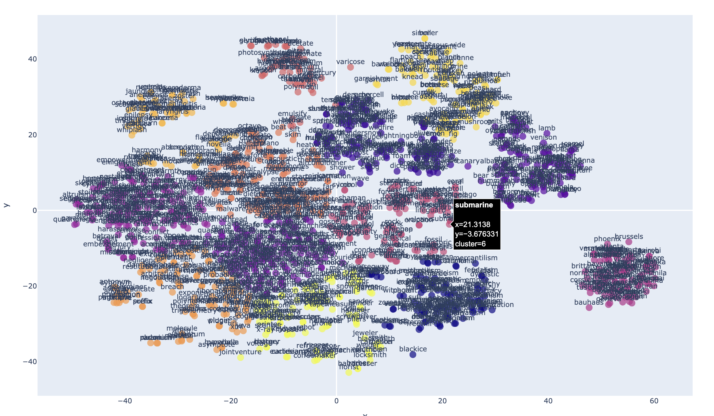

# Word Embedding Visualization Tool



## Description

This tool provides an easy way to visualize word embeddings using dimensionality reduction techniques (PCA or t-SNE) and clustering. It's particularly useful for analyzing and understanding high-dimensional word embedding models.

## Features
- Support for various word embedding models
- Dimensionality reduction using PCA or t-SNE
- Clustering
- Interactive HTML output

## Installation

### Prerequisites
- Python 3.9 or higher.

### Install via pip
```
pip install embeddings_plot 
```

### Embedding model

To use this tool you have to either train your own embedding model or use and existing pretrained model. This tool expected the models to be in word2vec format. Two pretrained models ready to use are:

- https://dl.fbaipublicfiles.com/fasttext/vectors-english/wiki-news-300d-1M.vec.zip
- https://dl.fbaipublicfiles.com/fasttext/vectors-english/crawl-300d-2M.vec.zip

Download one these models and unzip it, train your own model, or look for other pretrained word2vec models available on the internet.

## Usage

After installation, you can use the tool from the command line.

### Basic Command
```
embeddings-plot -m <model_path> -i <input_file> -o <output_file> --label
```

### Parameters
- `-m`, `--model`: Path to the word embeddings model file.
- `-i`, `--input`: Input text file with words to visualize.
- `-o`, `--output`: Output HTML file for the visualization.
- `-l`, `--labels`: (Optional) Show labels on the plot.
- `-c`, `--clusters`: (Optional) Number of clusters for KMeans. Default is 5.
- `-r`, `--rmethod`: (Optional) Method for dimensionality reduction (pca or tsne). Default is tsne.

### Example
```
embeddings-plot --model crawl-300d-2M.vec --input words.txt --output embedding-plot.html --labels --clusters 13 
```
